# Agri-Link Rwanda

Agri-Link Rwanda is a static website designed to showcase an agricultural marketplace platform that connects farmers, buyers, suppliers, and transporters in Rwanda.

## Project Overview

The website currently includes:
- A public marketing and authentication area
- Customer, seller, and administrator portals
- Marketplace, ordering, delivery, messaging, payment, and reporting screens
- Page-specific HTML, CSS, and JavaScript for each portal feature

## Features

- Clean and modern landing page
- Responsive layout using HTML and CSS
- Navigation across all main pages
- Informational sections for the platform’s purpose and services
- Form sections for login, registration, and contact

## Current Page Navigation Map

```mermaid
flowchart TD
	Visitor([Visitor]) --> Home[pages/index.html]
	Home --> About[pages/about.html]
	Home --> Contact[pages/contact.html]
	Home --> PublicMarketplace[pages/marketplace.html]
	Home --> PublicPrices[pages/market-prices.html]
	Home --> Login[pages/login.html]
	Home --> Register[pages/register.html]
	Login --> Register
	Login --> BuyerDashboard
	Login --> SellerDashboard
	Login --> AdminDashboard

	subgraph Buyer[Customer pages: customer/page layout/]
		BuyerDashboard[buyer-dashboard.html]
		BuyerMarketplace[marketplace.html]
		ProductDetails[product-details.html]
		Cart[cart.html]
		Checkout[checkout.html]
		BuyerOrders[buyer-orders.html]
		Tracking[tracking.html]
		Farmers[farmers.html]
		SavedProducts[saved-products.html]
		BuyerPrices[buyer-market-prices.html]
		BuyerMessages[buyer-messages.html]
		BuyerNotifications[buyer-notifications.html]
		BuyerPayments[buyer-payments.html]
		BuyerReviews[buyer-reviews.html]
		BuyerProfile[buyer-profile.html]
		BuyerSettings[buyer-settings.html]
		BuyerHelp[buyer-help.html]
		BuyerLogout[buyer-logout.html]

		BuyerDashboard --> BuyerMarketplace
		BuyerDashboard --> Cart
		BuyerDashboard --> BuyerOrders
		BuyerDashboard --> Tracking
		BuyerDashboard --> Farmers
		BuyerDashboard --> SavedProducts
		BuyerDashboard --> BuyerPrices
		BuyerDashboard --> BuyerMessages
		BuyerDashboard --> BuyerNotifications
		BuyerDashboard --> BuyerPayments
		BuyerDashboard --> BuyerReviews
		BuyerDashboard --> BuyerProfile
		BuyerDashboard --> BuyerSettings
		BuyerDashboard --> BuyerHelp
		BuyerDashboard --> BuyerLogout
		BuyerMarketplace --> ProductDetails
		BuyerMarketplace --> Cart
		ProductDetails --> Cart
		Cart --> Checkout
		Checkout --> BuyerOrders
		BuyerOrders --> Tracking
		Tracking --> BuyerMessages
	end

	subgraph Seller[Seller pages: seller/pages/]
		SellerDashboard[farmer-dashboard.html]
		SellerProducts[products.html]
		SellerOrders[orders.html]
		Buyers[buyers.html]
		SellerPrices[market-prices.html]
		SellerMessages[messages.html]
		Analytics[analytics.html]
		SellerReviews[reviews.html]
		Wallet[wallet.html]
		SellerNotifications[notifications.html]
		SellerProfile[profile.html]
		SellerSettings[settings.html]
		SellerHelp[help.html]
		SellerLogout[logout.html]

		SellerDashboard --> SellerProducts
		SellerDashboard --> SellerOrders
		SellerDashboard --> Buyers
		SellerDashboard --> SellerPrices
		SellerDashboard --> SellerMessages
		SellerDashboard --> Analytics
		SellerDashboard --> SellerReviews
		SellerDashboard --> Wallet
		SellerDashboard --> SellerNotifications
		SellerDashboard --> SellerProfile
		SellerDashboard --> SellerSettings
		SellerDashboard --> SellerHelp
		SellerDashboard --> SellerLogout
	end

	subgraph Admin[Admin pages: admin/pages/]
		AdminDashboard[admin-dashboard.html]
		Users[users.html]
		Verifications[verifications.html]
		AdminProducts[products.html]
		Categories[categories.html]
		AdminOrders[orders.html]
		Payments[payments.html]
		Deliveries[deliveries.html]
		Disputes[disputes.html]
		AdminMessages[messages.html]
		AdminNotifications[notifications.html]
		Reports[reports.html]
		AuditLogs[audit-logs.html]
		AdminProfile[profile.html]
		AdminSettings[settings.html]
		AdminHelp[help.html]
		AdminLogout[logout.html]

		AdminDashboard --> Users
		AdminDashboard --> Verifications
		AdminDashboard --> AdminProducts
		AdminDashboard --> Categories
		AdminDashboard --> AdminOrders
		AdminDashboard --> Payments
		AdminDashboard --> Deliveries
		AdminDashboard --> Disputes
		AdminDashboard --> AdminMessages
		AdminDashboard --> AdminNotifications
		AdminDashboard --> Reports
		AdminDashboard --> AuditLogs
		AdminDashboard --> AdminProfile
		AdminDashboard --> AdminSettings
		AdminDashboard --> AdminHelp
		AdminDashboard --> AdminLogout
	end

	classDef entry fill:#1f6f5b,color:#fff,stroke:#164f42;
	classDef portal fill:#e8f3ef,color:#164f42,stroke:#7db9a5;
	class Home,Login,Register entry;
	class BuyerDashboard,SellerDashboard,AdminDashboard portal;
```

This map is generated from the current HTML pages and the role destinations in `scripts/login.js`. Each portal also has matching page styles and scripts in its own `styles/` and `scripts/` directory; there is no backend or database connection yet.

## How to View the Project

Open the project in a browser by launching the home page:

- pages/index.html

You can also use a live server extension in VS Code for a smoother preview experience.

## Current Status

This is a front-end website at its current stage. It includes public pages and three role-based portal interfaces, but does not yet include backend functionality or a connected database.
